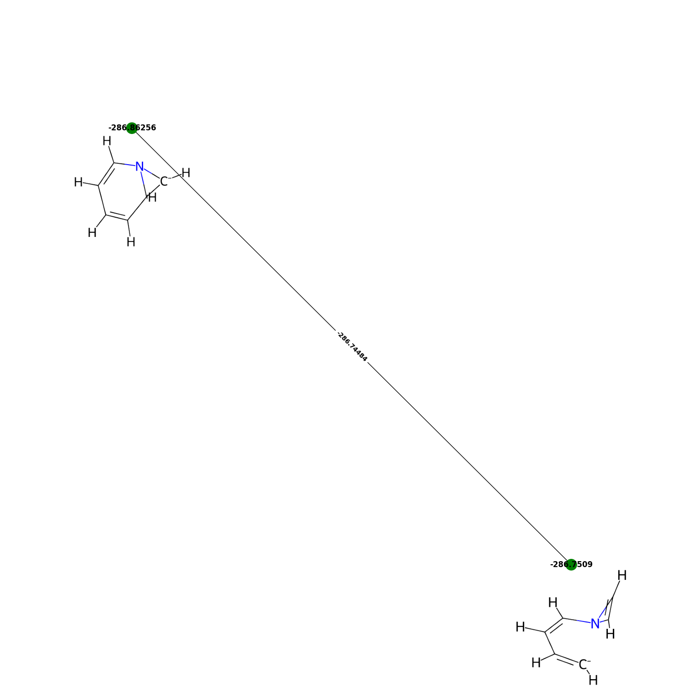

<p align="center">
    
</p>
connectRXN collects refined unit reactions (consist of optimized reactant, transition state, and product molecules) from molecular dynamic simulation trajectories. The trajectories need to be processed through the nanoreactor analysis code (https://github.com/leeping/nanoreactor) to be compatible with this code. The refined unit reactions from the nanoreactor code are typically in `gathered/reactions/reaction_xxx/Reaction/pathways/`. Adding a directory named with an integer in front (i.e. `012/gathered/reactions/..`) will allow connectRXN to navigate in to the directory and collect unit reactions. If there are multiple directories starting with different integers, it will collect unit reactions from all of them. Once the collection is done, it connects unit reactions based on their topologies. To distinguish mirror images and cis/trans isomers, two molecules with the same topology are aligned and RMSD values are calculated. If the RMSD is larger than a threshold, the two molecules will be considered different. networkx is used to map out a potential energy surface at the end.  

## Quick Set Up

First, we need to install xyz2mol package (https://github.com/jensengroup/xyz2mol). This package is employed to convert xyz format to SMILES.

Next, permutation_invariant_rmsd pacakge needs to be installed (https://github.com/lpwgroup/permutation_invariant_rmsd).


We can install connectRXN now.

```shell
git clone git@github.com:hjnpark/connectRXN.git 
cd connectRXN
pip install -e .
```
Done!

## User Guide

Running the command below in `example` directory will run the code. 

```shell
connect-rxn --charge -1
```

Note that the molecules in the example files are radicals with charge 0. Current version of this code can't generate 2D molecular images of radicals, so the charge value of -1 is given. 
`/reaction` directory will have all the unique reaction pathways as xyz files. The xyz file names show its reaction number and number of molecules in the pathway (`reaction number_number of molecules.xyz`). 
`/2D_images` directory contains 2D molecular images and graps generated by networkx can be found from `/graphs`.
Size and location of the images can be adjusted by using `--imgsize`, `--imgx`, and `--imgy`.
The command below will show available parameters.

```shell
connect-rxn -h
```

## To do

1) Allow code to accept unit reactions from just xyz files (or some other input files).
2) It can't create SMILES/images from radicals.


