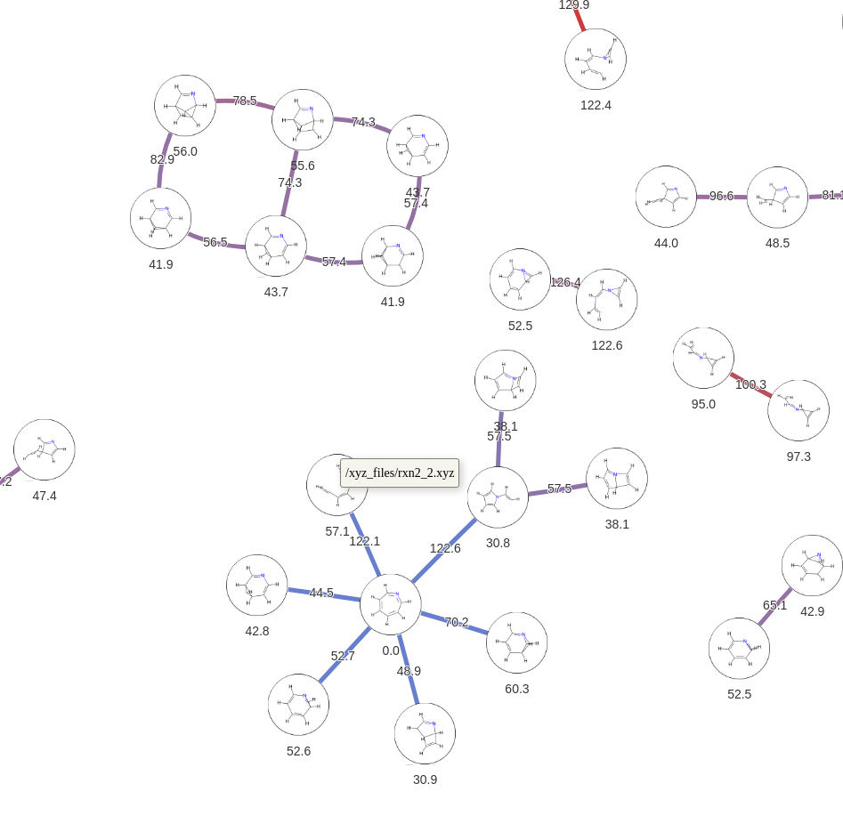

<p align="center">
    
</p>

# connectRXN
connectRXN collects refined unit reactions (consist of optimized reactant, transition state, and product molecules) from molecular dynamic simulation trajectories. 
The trajectories need to be processed through the nanoreactor analysis code (https://github.com/leeping/nanoreactor) to be compatible with this code. 
The refined unit reactions from the nanoreactor code are typically in `gathered/reactions/reaction_xxx/Reaction/pathways/`. 
Adding a directory named with an integer in front (i.e. `012/gathered/reactions/..`) will allow connectRXN to navigate into the directory and collect unit reactions. 
If there are multiple directories starting with different integers, it will collect unit reactions from all of them. 
Once the collection step is done, it will unify molecules with same geometries but different molecule objects. All pairwise intermediate molecules with the same topology are aligned and permuted RMSD values are calculated. 
If the lowest RMSD is smaller than a given threshold, the two molecules are considered identical. networkx and pyvis are used to map out a potential energy surface (html) at the end (energies are in kcal/mol).
The nodes can be relocated by dragging them. Paths to their xyz files can be seen when the mouse is over nodes or edges. 

## Quick Set Up

In a clean conda env with python 3.10, install xyz2mol from this repository (https://github.com/hjnpark/xyz2mol). This package was forked and modified from: https://github.com/jensengroup/xyz2mol. 
The modification can be found here: https://github.com/hjnpark/xyz2mol/commit/14a0b3fcfd2eacd615d4a2ef0599980c595874ed.
```shell
conda create -n connectRXN python=3.10
conda activate connectRXN
git clone git@github.com:hjnpark/xyz2mol
cd xyz2mol
pip install -e .
cd ..
```

Next, permutation_invariant_rmsd pacakge needs to be installed (https://github.com/lpwgroup/permutation_invariant_rmsd). 
```shell
git clone git@github.com:lpwgroup/permutation_invariant_rmsd
cd permutation_invariant_rmsd
pip install -e .
cd ..
```

We can install connectRXN now.
```shell
git clone git@github.com:hjnpark/connectRXN.git 
cd connectRXN
pip install -e .
```
Done!

## User Guide

Running the command below (or running `bash.sh`) in `example` directory will run the code. 

```shell
connect-rxn --charge 0 --rmsd 0.3 --imgsize 30 --htmlsize 1100
```
The rmsd value can generate different graphs.

Command below will show all the available parameters.
```shell
connect-rxn -h
```

## To do

1) Allow code to accept unit reactions from just xyz files (or some other input files).
2) Add ZPE options and put them under the electronic energies in the graphs.


